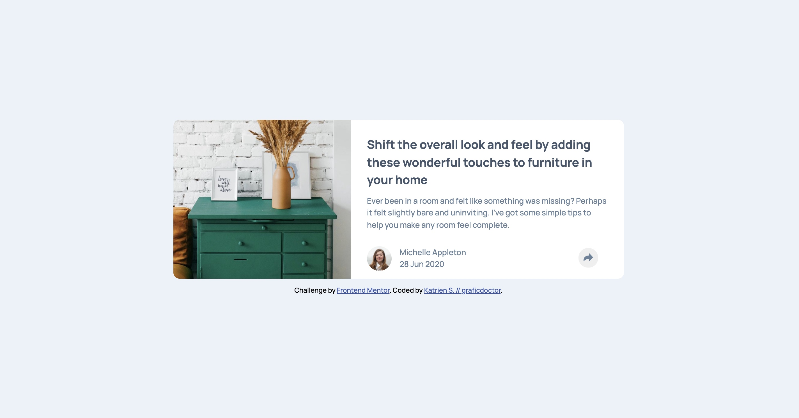
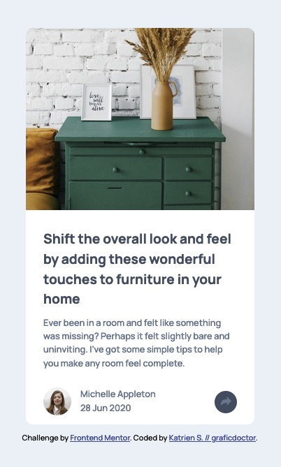

# Frontend Mentor - Article preview component solution

This is a solution to the [Article preview component challenge on Frontend Mentor](https://www.frontendmentor.io/challenges/article-preview-component-dYBN_pYFT). Frontend Mentor challenges help you improve your coding skills by building realistic projects.

## Table of contents

- [Overview](#overview)
  - [The challenge](#the-challenge)
  - [Screenshot](#screenshot)
  - [Links](#links)
- [My process](#my-process)
  - [Built with](#built-with)
  - [What I learned](#what-i-learned)
  - [Continued development](#continued-development)
- [Author](#author)

## Overview

### The challenge

Users should be able to:

- View the optimal layout for the component depending on their device's screen size
- See the social media share links when they click the share icon

### Screenshot

### Links

- Solution URL: [GitHub](https://github.com/graficdoctor/fe-12-article-preview-component)
- Live Site URL: [Vercel](https://fe-12-article-preview-component.vercel.app/)

## My process

### Built with

- Semantic HTML5 markup
- CSS custom properties
- Flexbox
- Mobile-first workflow

### What I learned

I learned that I still don't quite understand how positioning works.

### Continued development

I've been struggling a lot with implementing the position-elements, eventhough I think I understand the principle. The positioning doesn't seem to be ok on Safari and Chrome, but works on Firefox. I'll have to go through the theory again and re-apply in this excercise.

Changing colour in SVG's seems not to be that straightforward either.

Animation. But I didn't quite look into that yet.

## Author

- Website - [Add your name here](https://www.your-site.com)
- Frontend Mentor - [@yourusername](https://www.frontendmentor.io/profile/yourusername)
- Twitter - [@graficdoctor](https://www.twitter.com/yourusername)
